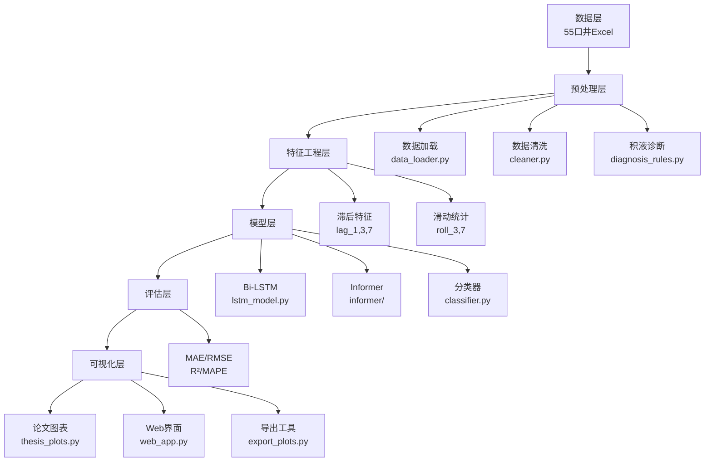

# 天然气产量预测系统 - 项目启动指南

> **项目**: 基于油田生产数据的天然气产量预测研究与应用  
> **作者**: 大数据222 潘锦煇  
> **日期**: 2026年4月

---

## 目录

1. [项目架构概览](#一项目架构概览)
2. [环境配置](#二环境配置)
3. [项目启动流程](#三项目启动流程)
4. [常见问题与解决方案](#四常见问题与解决方案)
5. [Docker部署方案](#五docker部署方案)
6. [Jupyter Notebook使用指南](#六jupyter-notebook使用指南)
7. [附录](#七附录)

---

## 一、项目架构概览

### 1.1 目录结构


streamlit run visualization\web_app.py

```
毕业设计/
├── Project/
│   ├── jian-lian-master/          # 原始Informer项目（参考）
│   │   ├── Code/                   # Informer源码
│   │   ├── Dataset/                # 原始数据集（55口井Excel）
│   │   └── README.md
│   │
│   └── src_v2/                     # 重构后的项目（★主项目）
│       ├── docs/                     # 文档目录
│       │   └── 项目启动指南.md       # ★本文档
│       │
│       ├── main_ultra.py           # 主程序入口
│       ├── main_with_plots.py      # 带图表生成的主程序
│       ├── generate_thesis_figures.py  # 一键生成论文图表
│       ├── config.py               # 全局配置
│       │
│       ├── models/                 # 模型定义
│       │   ├── lstm_model.py       # Bi-LSTM实现
│       │   ├── classifier.py       # 积液分类器
│       │   └── informer/           # Informer模型
│       │
│       ├── pre_processing/         # 数据预处理
│       │   ├── data_loader.py      # 数据加载器
│       │   ├── cleaner.py          # 数据清洗
│       │   ├── feature_eng.py      # 特征工程
│       │   └── diagnosis_rules.py  # 积液诊断规则
│       │
│       ├── evaluation/             # 评估模块
│       │   └── metrics.py          # 评估指标
│       │
│       ├── visualization/          # 可视化
│       │   ├── plot_results.py     # 基础绘图
│       │   ├── thesis_plots.py     # 论文图表（9大类）
│       │   ├── web_app.py          # Web界面
│       │   └── export_plots.py     # 导出工具
│       │
│       └── data/                   # 数据集（副本）
│           └── *.xlsx              # 55口井Excel文件
│
├── 双周报/                         # 进展双周报
├── 任务书/                         # 毕业设计任务书
├── 开题报告/                       # 开题报告文档
├── 文献综述/                       # 文献综述文档
├── 论文翻译/                       # 外文翻译
│
└── 项目启动指南.md                 # 本文档根目录副本
```

### 1.2 核心模块关系



---

## 二、环境配置

### 2.1 基础环境要求

| 组件 | 最低版本 | 推荐版本 | 说明 |
|------|----------|----------|------|
| Python | 3.8 | 3.9+ | 核心运行环境 |
| CUDA | 11.0 | 11.3+ | GPU加速（可选） |
| PyTorch | 1.9.0 | 1.12+ | 深度学习框架 |
| 内存 | 8GB | 16GB+ | 数据处理 |
| 磁盘 | 10GB | 50GB+ | 存储数据集和模型 |

### 2.2 创建虚拟环境

```bash
# 1. 进入项目目录
cd D:\毕业设计\Project\src_v2

# 2. 创建虚拟环境
python -m venv venv

# 3. 激活虚拟环境
# Windows:
venv\Scripts\activate
# Linux/Mac:
# source venv/bin/activate

# 4. 升级pip
python -m pip install --upgrade pip
```

### 2.3 安装依赖包

创建 `requirements.txt`：

```txt
# 核心依赖
numpy>=1.21.0
pandas>=1.3.0
scipy>=1.7.0
scikit-learn>=0.24.0

# 深度学习
torch>=1.9.0
torchvision>=0.10.0

# 可视化
matplotlib>=3.4.0
seaborn>=0.11.0
plotly>=5.3.0
bokeh>=2.4.0
pyecharts>=1.9.0

# Web框架（可选，用于可视化大屏）
flask>=2.0.0
dash>=2.0.0
streamlit>=1.0.0

# 数据处理
openpyxl>=3.0.0
xlrd>=2.0.0

# 工具
jupyter>=1.0.0
ipython>=7.0.0
tqdm>=4.62.0

# 文档生成
python-docx>=0.8.11
```

安装依赖：

```bash
pip install -r requirements.txt -i https://pypi.tuna.tsinghua.edu.cn/simple
```

验证安装：

```python
# 创建 test_env.py
import numpy as np
import pandas as pd
import torch
import matplotlib.pyplot as plt

print(f"✓ NumPy: {np.__version__}")
print(f"✓ Pandas: {pd.__version__}")
print(f"✓ PyTorch: {torch.__version__}")
print(f"✓ CUDA可用: {torch.cuda.is_available()}")
print("✓ 环境验证通过！")
```

运行：

```bash
python test_env.py
```

---

## 三、项目启动流程

### 3.1 快速启动（推荐）

```bash
# 1. 进入项目目录
cd D:\毕业设计\Project\src_v2

# 2. 激活虚拟环境
venv\Scripts\activate

# 3. 一键生成所有图表
python generate_thesis_figures.py

# 4. 查看生成的图表
start 论文图表\  # Windows
# 或
open 论文图表/   # Mac/Linux
```

### 3.2 分步启动（调试/开发）

#### 步骤1：数据准备

```python
# 检查数据集
from pre_processing.data_loader import DataLoader

well_files = DataLoader.get_all_well_files()
print(f"✓ 发现 {len(well_files)} 口井的数据文件")

# 加载单井数据示例
df = DataLoader.load_well_data(well_files[0])
print(f"✓ 数据形状: {df.shape}")
print(f"✓ 列名: {list(df.columns)}")
```

#### 步骤2：数据预处理

```python
from pre_processing.cleaner import DataCleaner
from pre_processing.feature_eng import FeatureEngineer

# 数据清洗
df_clean = DataCleaner.unify_formats(df_raw)
df_clean = DataCleaner.remove_outliers_3sigma(df_clean, ['wellhead_press', 'gas_volume'])
df_clean = DataCleaner.handle_missing_values(df_clean, ['wellhead_press', 'gas_volume'])

# 特征工程
df_feat = FeatureEngineer.add_lagged_features(df_clean, 'gas_volume', lags=[1, 3, 7])
df_feat = FeatureEngineer.add_rolling_features(df_feat, ['wellhead_press'], windows=[3, 7])
df_feat = df_feat.dropna()

print(f"✓ 特征工程后数据形状: {df_feat.shape}")
print(f"✓ 新增特征: {[c for c in df_feat.columns if 'lag' in c or 'roll' in c]}")
```

#### 步骤3：模型训练

```python
import torch
from sklearn.preprocessing import StandardScaler
from models.lstm_model import LSTMPredictor, LSTMTrainer

# 数据标准化
from sklearn.preprocessing import StandardScaler
scaler_x = StandardScaler()
scaler_y = StandardScaler()

X = scaler_x.fit_transform(df_feat[features].values)
y = scaler_y.fit_transform(df_feat[target].values.reshape(-1, 1))

# 构建时序窗口
seq_len = 30

# 准备数据
X_seq, y_seq = [], []
for i in range(len(X) - seq_len):
    X_seq.append(X[i:i+seq_len])
    y_seq.append(y[i+seq_len])

import numpy as np
X_tensor = torch.tensor(np.array(X_seq), dtype=torch.float32)
y_tensor = torch.tensor(np.array(y_seq), dtype=torch.float32).view(-1, 1)

# 划分数据集
split = int(len(X_tensor) * 0.8)
X_train, y_train = X_tensor[:split], y_tensor[:split]
X_test, y_test = X_tensor[split:], y_tensor[:split:]

print(f"✓ 训练集: {len(X_train)}, 测试集: {len(X_test)}")

# 创建模型和训练器
model = LSTMPredictor(input_size=len(features), hidden_size=128, num_layers=2, bidirectional=True)
trainer = LSTMTrainer(model, lr=0.001)

# 训练
train_loader = torch.utils.data.DataLoader(
    torch.utils.data.TensorDataset(X_train, y_train),
    batch_size=32, shuffle=True
)

# 手动训练循环以记录历史
history = {'train_loss': [], 'train_mae': []}

print("✓ 开始训练...")
for epoch in range(50):
    model.train()
    epoch_loss = 0
    epoch_mae = 0
    
    for batch_x, batch_y in train_loader:
        trainer.optimizer.zero_grad()
        output = model(batch_x)
        loss = trainer.criterion(output, batch_y)
        loss.backward()
        trainer.optimizer.step()
        
        epoch_loss += loss.item()
        epoch_mae += torch.mean(torch.abs(output - batch_y)).item()
    
    avg_loss = epoch_loss / len(train_loader)
    avg_mae = epoch_mae / len(train_loader)
    
    history['train_loss'].append(avg_loss)
    history['train_mae'].append(avg_mae)
    
    if (epoch + 1) % 10 == 0:
        print(f"  Epoch [{epoch+1}/50] - Loss: {avg_loss:.6f}, MAE: {avg_mae:.6f}")

print("✓ 训练完成")

# 预测
model.eval()
with torch.no_grad():
    y_pred_scaled = model(X_test).numpy()

y_pred = scaler_y.inverse_transform(y_pred_scaled)
y_true = scaler_y.inverse_transform(y_test.numpy())

# 评估
from sklearn.metrics import mean_absolute_error, mean_squared_error, r2_score

mae = mean_absolute_error(y_true, y_pred)
rmse = np.sqrt(mean_squared_error(y_true, y_pred))
r2 = r2_score(y_true, y_pred)
mape = np.mean(np.abs((y_true - y_pred) / y_true)) * 100

print("\n✓ 模型评估结果")
print(f"  - MAE:  {mae:.4f}")
print(f"  - RMSE: {rmse:.4f}")
print(f"  - R²:   {r2:.4f}")
print(f"  - MAPE: {mape:.2f}%")

# 4.5 可视化
print("\n✓ 正在生成可视化图表...")

from visualization.thesis_plots import (
    plot_feature_correlation,
    plot_prediction_comparison,
    plot_residual_analysis
)

# 1. 特征相关性热力图
plot_feature_correlation(df_feat, features)

# 2. 预测结果对比
y_full_pred = trainer.predict(X_tensor).numpy()
y_full_pred_inv = scaler_y.inverse_transform(y_full_pred)
y_full_true_inv = scaler_y.inverse_transform(y_tensor.numpy())

predictions_dict = {
    'Bi-LSTM': y_full_pred_inv.flatten()[:200],
}

plot_prediction_comparison(y_full_true_inv[:200], predictions_dict)

# 3. 残差分析
plot_residual_analysis(y_true, y_pred, model_name='Bi-LSTM')

print("\n✓ 所有图表已生成至 '论文图表/' 目录")
print("="*60)
